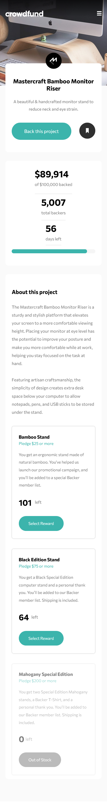

# Frontend Mentor - Crowdfunding product page solution

This is a solution to the [Crowdfunding product page challenge on Frontend Mentor](https://www.frontendmentor.io/challenges/crowdfunding-product-page-7uvcZe7ZR). Frontend Mentor challenges help you improve your coding skills by building realistic projects. 

Preview live site [here].(https://obscure-peak-65584.herokuapp.com/)

## Table of contents

- [Overview](#overview)
  - [The challenge](#the-challenge)
  - [Screenshot](#screenshot)
    - [Desktop View](#desktop-view)
    - [Mobile View](#mobile-view)
  - [Links](#links)
- [My process](#my-process)
  - [Built with](#built-with)
  - [Continued development](#continued-development)
  - [Useful resources](#useful-resources)
- [Author](#author)

## Overview

### The challenge

Users should be able to:

- View the optimal layout depending on their device's screen size
- See hover states for interactive elements
- Make a selection of which pledge to make
- See an updated progress bar and total money raised based on their pledge total after confirming a pledge
- See the number of total backers increment by one after confirming a pledge
- Toggle whether or not the product is bookmarked

### Screenshot

#### Desktop View:

#### Mobile View

### Links

- Solution URL: [My Solution](https://www.frontendmentor.io/solutions/crowdfunding-product-page-MADuFqlbY)
- Live Site URL: [Live Site](https://obscure-peak-65584.herokuapp.com/)

## My process

### Built with

- Semantic HTML5 markup
- CSS custom properties
- Flexbox
- Sass
- [Node.js](https://nodejs.org/en/docs/)
- [Express.js](https://expressjs.com/)
- [EJS](https://ejs.co/) 

### Continued development
- Get more practice with javascript.

### Useful resources
- [How to create a custom progress bar](https://www.florin-pop.com/blog/2019/06/how-to-create-a-custom-progress-bar/).
- [W3Schools](https://www.w3schools.com/) - This is an amazing website for looking up, learning and fully understanding things.
- [jQuery](https://api.jquery.com/)
- [CSS Tricks- Change SVG Color](https://css-tricks.com/change-color-of-svg-on-hover/)
- [Stack Overflow](https://stackoverflow.com/)
- [MDN Docs- Javascript](https://developer.mozilla.org/en-US/docs/Web/JavaScript)

## Author
- Frontend Mentor - [@Josh_Ay](https://www.frontendmentor.io/profile/Josh-Ay)